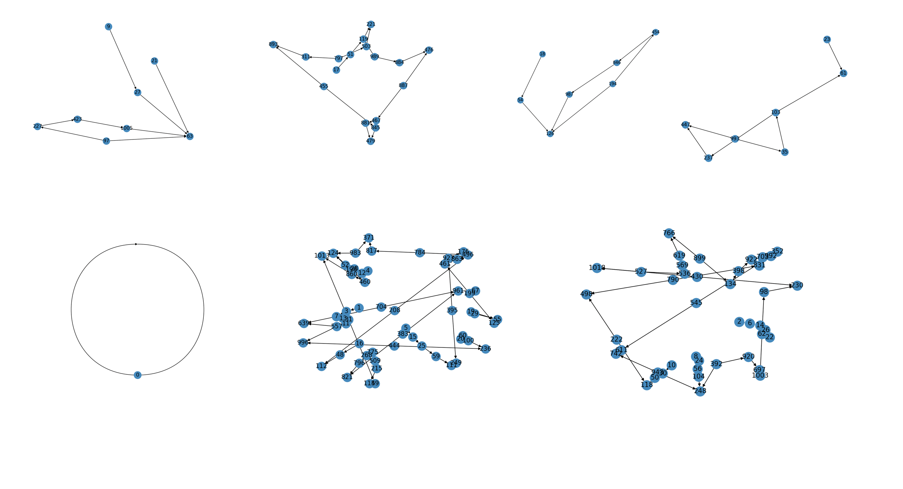

# 1DECA
generate one dimensional elementary cellular automata


## Install
`pip install eca`

## Example 1: Basics

```python
from eca import OneDimensionalElementaryCellularAutomata

configuration = OneDimensionalElementaryCellularAutomata(initial_configuration="0000100001011")
configuration.transition(rule_number=110)
str(configuration)
```
> 0001100011111


## Example 2: Displaying CA evolution

```python
from eca import OneDimensionalElementaryCellularAutomata
from matplotlib.pyplot import imshow

configuration = OneDimensionalElementaryCellularAutomata(lattice_width=1000)

for _ in range(400):
    configuration.transition(rule_number=110)

imshow(configuration.evolution(),cmap='gray')
```


## Example 3: Viewing Attractor Basins

```python
from eca import OneDimensionalElementaryCellularAutomata
from networkx import DiGraph, draw

RULE = 3
WIDTH = 5
DEPTH = 100
MAX_IC = 30

GRAPH = DiGraph()


for IC in range(MAX_IC):
    cellular_automata = OneDimensionalElementaryCellularAutomata(
        initial_configuration=IC,
        lattice_width=WIDTH
    )
    for _ in range(DEPTH):
        cellular_automata.transition(RULE)
    
    GRAPH.add_edges_from(cellular_automata.graph(RULE).items())
    
draw(GRAPH, with_labels=True)
```


## Example 4: Viewing Each Attractor basin separately
```python

from eca import OneDimensionalElementaryCellularAutomata
from networkx import DiGraph, strongly_connected_components, draw_spring

RULE = 110
WIDTH = 10
DEPTH = 100
MAX_IC = 30

GRAPH = DiGraph()


for IC in range(MAX_IC):
    cellular_automata = OneDimensionalElementaryCellularAutomata(
        initial_configuration=IC,
        lattice_width=WIDTH
    )
    for _ in range(DEPTH):
        cellular_automata.transition(RULE)
    
    GRAPH.add_edges_from(cellular_automata.graph(RULE).items())

for nodes in connected_components(GRAPH):
    draw_spring(GRAPH.subgraph(nodes), with_labels=True)
    
```


## More examples:
see `example.ipynb`
